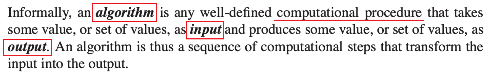
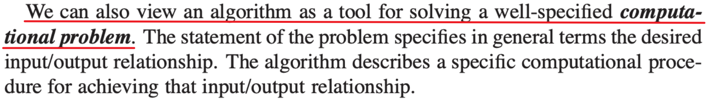

## 알고리즘이란

알고리즘 교과서인 CLRS(Introduction To Algorithms)에서는 알고리즘을 2가지 관점에서 정의하고 있다.

### 본질적인 관점

알고리즘은 본질적으로 주어진 입력(input)에 대해 출력(output)을 반환하는 계산 절차(computational procedure)다. 
주어진 입력에 대해, 특정 출력값이 나오도록 연산들을 순서대로 나열한 거라고 이해하면 됨. 

### 기능적인 관점

어떤 입력에 대해 특정 출력을 요구하는 문제를 계산 문제(computational problem)라고 함. 
따라서 알고리즘은 기능적인 관점에서 이러한 계산 문제를 푸는 도구로 볼 수 있는 것. 

### 알고리즘을 공부할 때

두 가지 관점에서의 정의를 정리하면 알고리즘은 문제에 대한 풀이 절차다.

보통 알고리즘을 공부할 때 절차(procedure)에 집중하게 되는데 
이 절차가 **어떤 문제를 위한 것인지** 또한 중요하게 생각해야 한다.

지금 내가 쓰는 알고리즘이 어떤 문제에 대한 풀이인지 기억하자는 거다.

## 알고리즘의 성능

- 정확성(Correctness) : 정확한 output을 출력하는가
- 효율성(Efficiency) : 시간/공간 활용을 얼마나 잘 하는가

### 정확성 (Correctness)

주어진 입력에 대해 올바른 출력을 반환하는가.

당연한 소리 같지만, 알고리즘이 모든 입력에 대해 정확하게 동작한다는 걸 어떻게 증명할 것인가는 별개의 문제다. 
대표적인 증명 도구로 루프 불변식(Loop Invariant)이 있는데, 이건 삽입 정렬 포스팅에서 자세히 다룬다.

### 효율성 (Efficiency)

정확한 출력을 내더라도, 시간이 너무 오래 걸리거나 메모리를 너무 많이 쓰면 쓸모가 없다.

같은 문제를 푸는 알고리즘이 여러 개 있을 때, 어떤 게 더 효율적인지 비교할 수 있어야 한다. 
이게 알고리즘 분석(Analysis)의 핵심이다.

## 효율성을 어떻게 측정하는가

효율성은 시간과 공간, 두 가지 축으로 따진다.

### 시간 복잡도 (Time Complexity)

알고리즘이 얼마나 빠른가. 단, 여기서 "빠르다"는 실제 실행 시간(초)이 아니다.

실행 시간은 하드웨어, 언어, 컴파일러 등에 따라 달라지기 때문에 기계 독립적인 척도가 필요하다. 
그래서 **입력 크기 n에 따른 연산 횟수**를 기준으로 삼는다.

### 공간 복잡도 (Space Complexity)

알고리즘이 메모리를 얼마나 쓰는가.

시간 복잡도와 같은 방식으로, 입력 크기 n에 따른 메모리 사용량으로 측정한다.

보통 시간 복잡도를 더 중요하게 따지는데, 메모리는 늘릴 수 있어도 시간은 되돌릴 수 없기 때문이다. 
물론 메모리 제약이 빡빡한 상황에서는 공간 복잡도도 중요해진다.

## 점근 표기법

입력 크기 n에 따른 연산 횟수를 정확하게 세는 건 복잡하고, 그럴 필요도 없다. 
중요한 건 n이 충분히 커졌을 때 **어떤 속도로 증가하느냐**다.

$2n^2 + 3n + 5$ 에서 n이 충분히 크면 $3n + 5$는 $2n^2$에 비해 무시할 수 있다. 
$2n^2$에서 상수 계수 2도, 하드웨어에 따라 달라질 수 있는 값이니 무시한다. 
결국 남는 건 $n^2$이라는 **증가율** 뿐이다.

이 증가율을 표현하는 방법이 점근 표기법(Asymptotic Notation)이다.

### Big-O (O) — 상한

$O(g(n))$: 최악의 경우에도 $g(n)$보다는 빠르다 (이보다 느려지진 않는다)

상한만 알아도 충분한 경우가 있다. "이 알고리즘은 아무리 느려도 $O(n^2)$이다" — 이것만으로도 쓸지 말지 판단할 수 있으니까.

### Big-Omega (Ω) — 하한

$\Omega(g(n))$: 아무리 빨라도 $g(n)$보다는 느리다 (이보다 빨라질 수 없다)

하한이 정해진 경우, 더 최적화할 여지가 있는지 판단할 수 있다.

### Big-Theta (Θ) — 딱 그 증가율

$\Theta(g(n))$: 정확히 $g(n)$의 속도로 증가한다

O로 상한을 잡고, Ω로 하한을 잡고, 양쪽을 좁혀갔을 때 둘이 만나는 지점이 Θ다. 
가장 정확한 표현이기 때문에 보통 복잡도를 말할 때는 Θ를 쓰는 게 맞지만, 관습적으로 O를 많이 쓴다.

### 주요 복잡도 클래스

| 표기 | 이름 | 예시 |
|------|------|------|
| $O(1)$ | 상수 | 배열 인덱스 접근 |
| $O(\log n)$ | 로그 | 이진 탐색 |
| $O(n)$ | 선형 | 배열 순회 |
| $O(n \log n)$ | 선형 로그 | 병합 정렬 |
| $O(n^2)$ | 이차 | 선택 정렬, 버블 정렬 |
| $O(2^n)$ | 지수 | 부분집합 열거 |

n이 커질수록 클래스 간 차이는 극적으로 벌어진다.

## 정렬 문제(Sorting Problem)부터 시작하는 이유

CLRS에서 알고리즘 공부에 있어 강조하는 2가지가 있다. **설계(Design)**와 **분석(Analysis)**이다.

- **분석**: 삽입 정렬을 통해 알고리즘의 동작을 증명하고 복잡도를 분석하는 법을 배운다
- **설계**: 분할 정복이라는 설계 패러다임을 통해 병합 정렬이라는 새로운 알고리즘을 만들어내는 과정을 경험한다

정렬 문제는 이 두 가지를 모두 가르치기에 가장 좋은 문제이기 때문에 CLRS 맨 앞에 등장하는 것이다.

다음 포스팅에서는 정렬 문제와 정렬 알고리즘 개요를 다룬다.