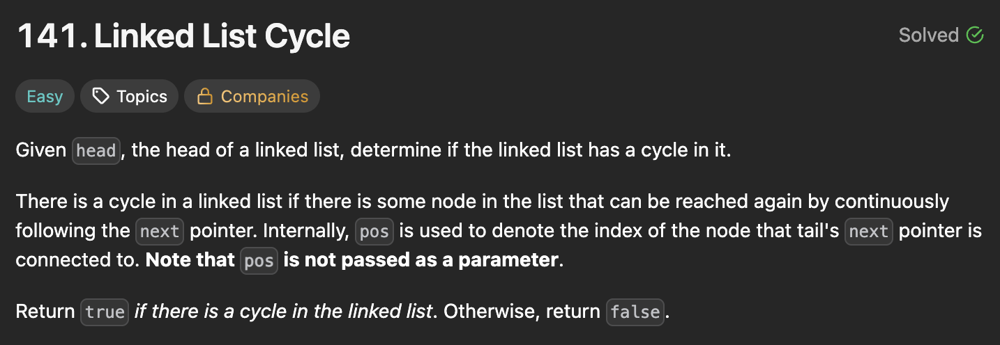
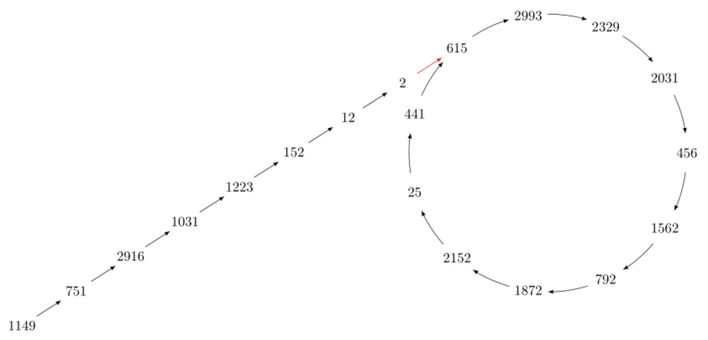
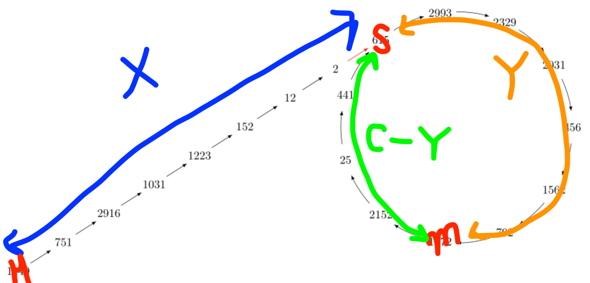

## 링크드 리스트 문제를 풀다가..

<div style="width: 800px;">



</div>
LeetCode Top Interview 150의 141번 문제다.<br>

링크드 리스트에 사이클이 있는지 확인하면 되는데<br>

```python
# Definition for singly-linked list.
# class ListNode:
#     def __init__(self, x):
#         self.val = x
#         self.next = None
```
이렇게 생긴 객체의 방문 처리를 어떻게 하는지 몰라서 헤맸다..<br>
이런 녀석들은 객체의 메모리 기반으로 방문 처리를 할 수 있는 set을 쓰면 된다.

```python
class Solution:
    def hasCycle(self, head: Optional[ListNode]) -> bool:
        
        visited = set()
        curr = head

        while curr:
            if curr in visited:
                return True
            # 방문한적 없으면
            visited.add(curr)
            curr = curr.next

        return False
```
그런데 이렇게 풀고 나니, 문제 description 마지막에<br>
"너 이거 메모리 O(1)만 쓰고 풀 수 있음?" 라고 도발한 것을 봤다..

맨 처음 사이클 감지를 알게 된게 DFS에서 였는데

DFS도 결국엔 노드별로 discovered time이랑 finished time을 기록하든<br>
방문 상태(미방문/탐색중/탐색완료)를 기록하든 O(V)의 추가 메모리가 필요하다.

그래서 이걸 어떻게 해야 하나 찾아보다가 나온게 플로이드의 알고리즘이다.


## Floyd's tortoise and hare Algorithm

토끼와 거북이라고 불리는 사이클 감지 알고리즘이다.

링크드 리스트처럼 다음 노드 선택지가 최대 1개 밖에 없는,<br>
모든 노드의 out-degree가 1 이하인 그래프를 functional graph라고 하는데

토끼와 거북이 알고리즘은 이러한 functional graph에서 사이클을 감지할 수 있다.


## 사이클 감지

```python
def detect_cycle(head):
    slow, fast = head, head
    while fast and fast.next:
        slow = slow.next
        fast = fast.next.next
        if slow == fast:
            return slow
    return None 
```

사이클 감지 자체는 간단하다.<br>
slow 포인터는 한칸씩, fast 포인터는 두칸씩 전진하게 된다.

fast 포인터가 slow 포인터와 만나지 않고 마지막 노드에 도달하면<br>
while문이 종료되고 사이클이 없다는 결론을 내리면서 None을 반환한다.

while문이 종료되기 전에 두 포인터가 한 노드에서 만나면<br>
그 노드를 반환하면서 사이클 존재를 알린다.<br>


여기서 노드를 반환하는 이유는 사이클의 시작점을 알아내기 위함이다.<br>

그래서 그냥 사이클 감지만 하면 되는 141번 문제의 경우,<br>
return하는 값을 slow에서 True로, None에서 False로 바꿔주면 된다.

그러면 상수 메모리(포인터 2개)만 쓰고 사이클을 감지할 수 있다.


### 직관적 이해

토끼가 먼저 마지막 지점에 도착했을 때 사이클이 없다는건 자명하다.<br>
사이클이 있다면 while 반복문이 끝날 수가 없다.

반대로 사이클이 있을 때, 토끼와 거북이가 만날 수 밖에 없다는건<br>
뭔가 그래야 할 것 같긴 한데 명확하게 설명하기가 어렵다.

시점을 나눠서 이해해보자.

<div style="width: 700px;">



</div>

거북이와 토끼의 보폭은 각각 1과 2이기 때문에<br>
둘의 격차는 매 움직임마다 1씩 벌어지게 된다.

하지만 둘다 사이클에 들어온 시점에서는 둘의 격차가 줄어든다.

사이클에 들어오기 전에 벌어진 격차는 거북이가 토끼를 따라잡기 위한 거리고<br>
사이클에 들어온 후 줄어드는 격차는 토끼가 거북이를 따라잡기 위한 거리다.

두 거리를 합친게 사이클 길이가 되는데, 사이클 길이는 일정하기 때문에<br>
한 쪽이 증가하면, 반대쪽이 그만큼 줄어드는게 당연하다.

아무튼 이 격차는 한칸씩 줄어들기 때문에 토끼와 거북이는 어느 순간 만날 수 밖에 없다.

따라서 사이클이 존재하면, 토끼와 거북이는 반드시 사이클 안에 노드에서 만나게 되고<br>
그 처음 만나는 노드를 `detect_cycle` 함수에서 반환하게 된다.

## 사이클 시작점 찾기

토끼와 거북이가 처음 만난 노드는 왜 반환하는거냐, 사이클의 시작점을 찾고 싶을 때 필요해서 그렇다.

```python
def find_cycle_start(head, meet):
    ptr = head
    slow = meet
    while ptr != slow:
        ptr = ptr.next
        slow = slow.next

    return ptr # 사이클 시작점
```

사이클 시작점을 찾는 방법도 매우 간단하다.<br>

거북이와 동일하게 한칸씩 이동하는 포인터를 준비시킨다.<br>
포인터는 헤드에서, 거북이는 토끼와 만난 노드에서 동시에 출발하게 된다.

두 포인터가 최초로 만나는 노드가 바로 사이클의 시작점이다.


### 수학적 증명

사이클 감지 부분은 수학적 증명 없이도 그러려니 할 수 있는데<br>
사이클 시작점 찾기는 왜 그렇게 되는지 직관적으로 이해하기 어렵다.

이 부분도 정말 그러한지 수식으로 따져보자.


<div style="width: 700px;">



</div>

포인터의 출발점(헤드)를 $H$, 사이클 시작점을 $S$, 거북이와 토끼가 만난 지점을 $m$이라 하고

사이클을 제외한 직선거리를 $X$, 사이클 이후 거북이가 움직인 거리를 $Y$,<br>
사이클 길이를 $C$, 토끼가 거북이보다 추가로 사이클을 돈 횟수를 $n$이라고 하자.

그러면 거북이와 토끼가 움직인 거리 $D_t$, $D_r$을 다음과 같은 식으로 나타낼 수 있다.

- $D_t = X + Y$ 
- $D_r = X + Y + n⋅C$

그리고 토끼의 속도는 거북이의 두 배이기 때문에 $D_r$은 다음 식으로도 나타낼 수 있다.

- $D_r = 2D_t = 2(X+Y)$

처음에 $D_r$에 대한 두 가지 표현을 가지고 식을 연립하면

- $2(X+Y) = X + Y + n⋅C$
- $ X = n⋅C - Y $

마지막에 $X$를 $n⋅C - Y$ 형태로 표현했다는 결과만 기억하면 된다.<br>

이게 왜 중요하냐?<br>
거북이가 현재 위치 $m$에서 사이클 시작점 $S$까지 가려면 $C - Y$만큼 이동해야 한다.<br>
$C - Y$만큼 이동한 후에는 사이클 길이인 $C$만큼 이동할 때마다 사이클 시작점에 위치한다.

이걸 일반화하면, 거북이는 현재 위치 $m$에서 이동한 거리가
- $ (C - Y) + k⋅C = (k+1)⋅C - Y $

$(k+1)⋅C - Y$ 형태일 때 사이클 시작점 $S$에 위치하게 된다.


정리하면
- 거북이는 $m$에서 출발해서 $(k+1)⋅C - Y$만큼 이동하면 $S$에 위치
- 포인터는 $H$에서 출발해서 $n⋅C - Y$만큼 이동하면 $S$에 위치

포인터가 최초로 $S$에 도착했을 때, 거북이도 $S$에 위치하게 된다.


### 유감스러운 점

이러한 수학적 증명을 이해 못한다고 알고리즘을 못 쓰나? 그건 아니다.<br>

알고리즘의 근간과 어떻게 이런 아이디어를 떠올렸는지를 배우려고 증명 과정을 보는 것인데<br>
알고리즘에서 correctness을 보장하는 내용들이 나한테는 직관적으로 이해하기 어렵다..

알고리즘 만든 컴퓨터 과학자들은 도대체 뭐하는 사람들이었을까..


### 주의할 점

이 알고리즘을 통해 functional graph에서 사이클을 감지할 수 있다고 했는데,<br>
시작점 찾기는 그래프의 헤드가 사이클 안에 있으면 제대로 동작하지 않는다.

링크드 리스트는 헤드가 사이클 안에 있을 수 없기 때문에<br>
사이클 감지, 사이클 시작점 찾기 모두 문제 없이 동작한다.


## 사이클 길이 측정
```python
def find_cycle_length(cycle_start):
    length = 1
    cur = cycle_start.next
    while cur != cycle_start:
        cur = cur.next
        length += 1
    return length
```

사이클 길이 구하는 것은 이해하기 쉽다.<br>

사이클 시작점에서 출발해서 다시 시작점으로 돌아올 때까지의 길이를 측정하면 된다.
