## Intro
CLRS에서 힙 정렬에 대해 설명할 때 병합 정렬, 삽입 정렬과 비교한다.<br>
힙 정렬은 병합 정렬처럼 $O(n \log n)$의 시간이 소요된다. 그리고 삽입 정렬처럼 in-place 방식이다.<br>

정렬 시간도 빠르고, 입력 배열 안에서 정렬해서 추가적인 메모리 소요가 적다는 뜻이다.<br>
이런 일을 가능하게 하는건 힙(Heap)이라는 자료 구조다.<br>

힙은 단순히 정렬에만 쓰이는게 아니고 우선순위 큐라는 녀석을 구현하는데도 사용된다.

## 힙(Heap)
힙이라는 자료구조를 이해하려면 어떤 형태로 데이터를 저장하는지,<br>
그리고 저장된 원소들이 어떤 규칙을 만족해야 하는지 알아야 한다.

### 거의 완전 이진 트리와 배열 표현
CLRS에서 말하는 힙은 기본적으로 이진 힙이고, 그 실체는 다음과 같다.<br>
거의 완전 이진 트리(Nearly Complete Binary Tree)로 볼 수 있는 배열 객체

이게 무슨 소리냐

:::div{style="width: 555px"}
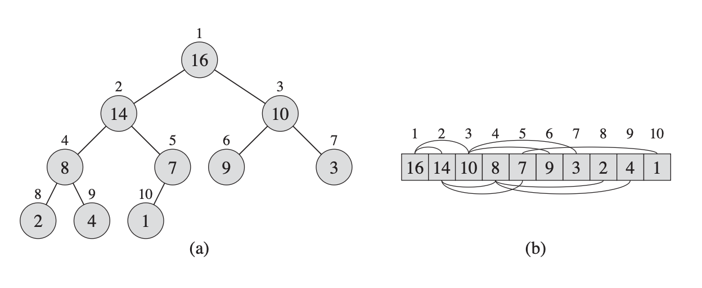
:::

물리적인 저장 형태는 (b)처럼 배열이지만, 논리적으로는 (a)처럼 이진 트리로 볼 수 있다는 거다.<br>
그냥 이진 트리이면 안되고 거의 완전(Nearly Complete)<br>
그러니까 완전 이진 트리인데 마지막 레벨만 왼쪽부터 일부 채워지는걸 허용하는 형태여야 한다.<br>

> 완전 이진 트리나, 거의 완전 이진 트리나 별 구분을 안하기도 한다.

:::div{style="width: 180px"}
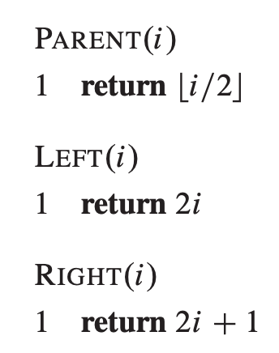
:::

이런 식으로 배열의 인덱스 계산을 통해 부모 자식 관계를 나타내면<br>
트리 노드를 만들지 않고도 배열로 거의 완전 이진 트리를 표현할 수 있다.

이건 CLRS 이론에서만 이렇게 하는게 아니고 실제 프로그래밍 언어들도 배열로 힙을 구현한다.<br>
그냥 트리 노드 만들면 되는거 아닌가 싶을수도 있지만 배열이 주는 이점이 있어서 그렇다.

일단 노드마다 부모와 자식 포인터를 저장하지 않아도 되고<br>
배열이라는게 연속적인 메모리 공간이라 캐시 접근에도 유리하다.

### 힙 속성(Heap Property)

이런 형태의 배열을 전부 힙이라고 부를 수 있는건 아니다. <br>
저장된 원소들이 특정 규칙을 지켜야 비로소 힙이라고 부를 수 있는데, 그걸 힙 속성이라고 부른다.

힙 속성은 최대 힙 속성(Max Heap Property)과 최소 힙 속성(Min Heap Property)이 있다.<br>
최대 힙 속성을 만족하는걸 최대 힙, 최소 힙 속성을 만족하는걸 최소 힙이라고 부른다.

:::div{style="width: 396px"}
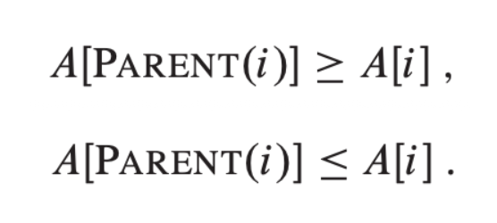
:::

최대 힙 속성 - 부모의 값이 자식의 값보다 크거나 같아야 함<br>
최소 힙 속성 - 부모의 값이 자식의 값보다 작거나 같아야 함

루트를 제외한 모든 노드에서 이 속성을 만족해야 그 배열을 힙이라고 부를 수 있다.

> 물리적으로는 배열의 원소지만, 트리로 해석할 때는 각 원소를 노드라고 부른다.

### 힙 속성이 보장하는 것

최대 힙이라고 한다면 루트가 힙에서 가장 큰 값인게 보장이 되고<br>
최소 힙이라면 반대로 루트가 힙에서 가장 작은 값인게 보장이 된다.

오해하면 안되는게 힙 자체는 정렬된 상태를 보장하지 않는다.<br>
힙 속성을 만족한다는거랑 정렬된 상태다 라는건 아예 다른 얘기다.

힙의 루트에는 최대값(또는 최소값)이 있구나 <- 이걸 보장하는거다.

### 힙과 노드의 높이

먼저 CLRS에서 말하는 엄밀한 정의를 보자.

힙을 트리로 볼 때, 힙에 있는 한 노드의 높이(height)는 그 노드에서 리프까지 <br>
아래로 내려가는 단순 경로 중 가장 긴 경로에 포함된 간선의 수로 정의한다.

힙의 높이는 루트의 높이로 정의한다.

힙은 (거의)완전 이진 트리니까, 원소 개수가 n개인 힙의 높이는 $\Theta(\log n)$가 된다.<br>
힙의 기본 연산 중 다음 연산들은 힙의 높이에 비례하여 $O(\log n)$의 시간이 걸린다.

- $Heapify$ : $O(\log n)$
- $Insert$, $Extract$, $Increase\,\,Key$ : $O(\log n)$

이 기본 연산들로 힙을 만들고, 힙 정렬을 하고 우선순위 큐를 만들게 된다.


## 힙의 주요 연산
$Heapify$가 핵심이고 $Build\,\,Heap$은 그냥 $Heapify$의 반복 실행이라<br>
$Heapify$를 정확하게 이해하는게 가장 중요하다.

### $Heapify$
$Heapify$라는 연산의 목적은 힙 속성을 유지하는 것이다.

배열 $A$ 와 인덱스 $i$ 가 인풋으로 들어가는데 이 연산을 실행하려면  전제가 하나 있다.<br>
$i$ 의 자식 노드 $Left(i)$와 $Right(i)$를 루트로 하는 서브 트리들은 이미 힙이어야 한다.

왜 이런 전제가 필요한가?

$Heapify$는 설계 자체가 무일푼 바닥에서 시작해서 힙을 만드는 알고리즘이 아니라

아래 서브 트리들은 이미 힙이라는 가정 하에, $Left(i)$ 또는 $Right(i)$와 <br>
그 부모인 $i$의 관계에서 위반된 힙 속성을 복구하는 연산이기 때문에 그렇다.

:::div{style="width: 374px"}
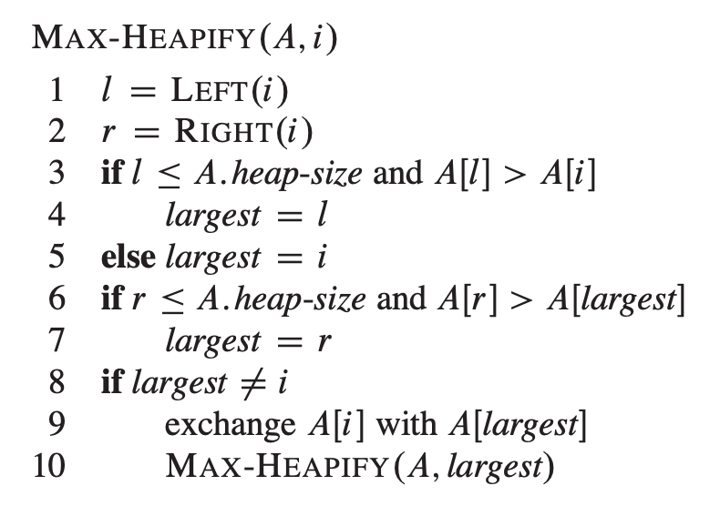
:::

최대 힙을 기준으로 $Heapify$가 하는 일을 살펴보자.

$Heapify$는 인자로 받은 인덱스 $i$에 대해 $Left(i)$와 $Right(i)$의 값을 확인한다.<br>
둘 중에 $A[i]$ 보다 큰 값이 있는지, 힙 속성을 위반하는지 체크하기 위함이다.

자식들 중에 더 큰 값이 있다면 그 값을 $A[i]$와 교환하고,<br>
만약 둘다 $A[i]$ 보다 크다면, 둘 중에 더 큰 값을 $A[i]$와 교환한다.

그러면 결과적으로 $Left(i)$ 기준으로도, $Right(i)$ 기준으로도<br>
부모의 값이 자식의 값보다 크니까 힙 속성을 만족하게 된다.

그런데 10번째 줄을 보면 자식과 부모의 값을 교환한 경우에<br>
교환한 자식의 인덱스로 다시 한번 $Heapify$를 재귀 호출한다.

:::div{style="width: 458px"}
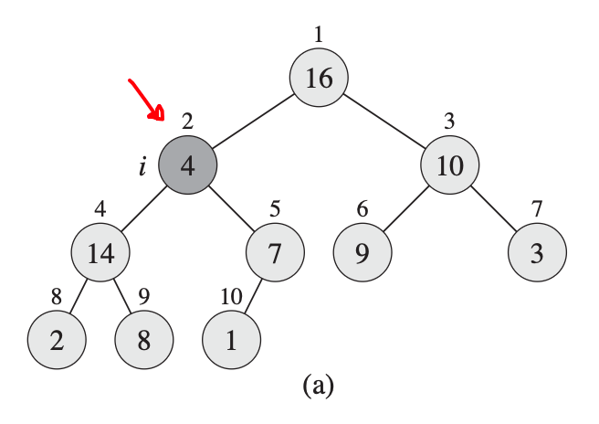
:::

실제 상황을 살펴보면 이 재귀 호출이 왜 필요한지 알 수 있다,<br>
2번 노드의 값 4가 자식 노드의 값들 14와 7보다 작아서 힙 속성 위반이 발생했다.


:::div{style="width: 460px"}
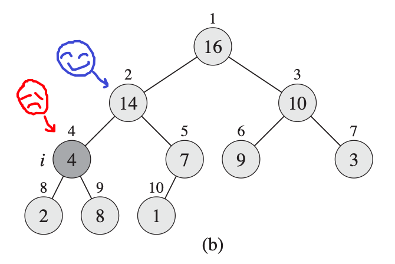
:::

자식 노드의 값 중에 더 큰 14와 4를 교환하고 나면<br>
2번 노드와 자식들 사이에 힙 속성은 복구가 되었다.

하지만 교환이 일어난 쪽에는 원래 값보다 작은 값이 교체되어 들어왔기 때문에<br>
교환이 일어난 쪽의 서브 트리에서는 최대 힙 속성이 다시 깨질 수 있다.

따라서 교환된 자식 인덱스를 루트로 하는 서브 트리에 대해서 $Heapify$를 호출하여<br>
힙 속성을 복구하는 작업을 재귀적으로 실행해야 한다.

언제까지? 더 이상 힙 속성을 위반하지 않거나 리프 노드에 도달할 때까지.

리프 노드는 자식이 없으니까 그 자체로 서브 트리이자 힙으로 볼 수 있어서<br>
$Heapify$를 호출해도 아무 일 없이 종료된다.

> 수도 코드에서는 리프 노드의 $Left(i)$와 $Right(i)$의 범위가 $heap\,\,size$를 벗어난다.<br>
> 조건문이 참이 되는 경우가 발생하지 않아서 아무 일 없이 종료되는 구조다.


:::div{style="width: 462px"}
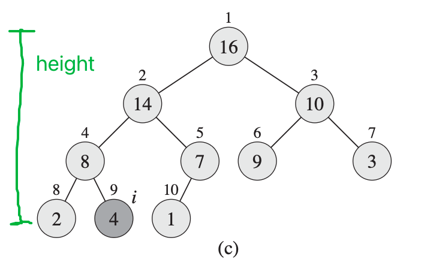
:::

하나의 노드에서 자식 노드와 값을 교환하며 힙 속성을 복구하는건<br>
단순한 배열 값의 교환이라 상수 시간 밖에 소요되지 않는다.

$Heapify$는 최악의 경우, 현재 노드부터 리프 노드까지 내려가면서 재귀 호출되기 때문에<br>
전체 시간복잡도가 최대 재귀 호출 수(높이)에 비례하여 $O(\log n)$가 되는 거다.


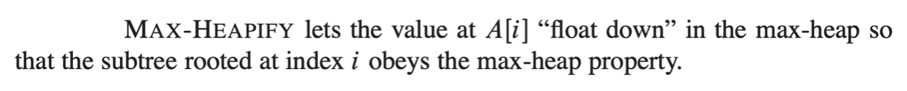

> **NOTE**
> CLRS에서는 $Heapify$ 연산이 노드 $i$를 루트로 하는 서브트리가 힙 속성을 준수(만족)하게 만든다고 표현한다.
>
> 하지만 '어떤 노드의 힙 속성을 복구하냐'의 관점에서 보면 노드 $i$의 힙 속성을 복구하는게 아니다.
>
> CLRS에서 힙 속성에 대한 정의는 $i$와 $Parent(i)$ 사이의 관계인데, $Heapify$는 인자로 받은 $i$의 부모를 확인하는게 아니라, 자식인 $Left(i)$와 $Right(i)$의 값을 확인한다.
>
> 그래서 엄밀하게 말해서 $Heapify$는 $i$ 노드가 힙 속성을 만족시키게 하는게 아니라<br>
> $Left(i)$와 $Right(i)$가 힙 속성을 만족시키게 하는 연산이다.
>
> 근데 딱히 중요한 포인트는 아닌거 같다. 전체 복구를 위해 재귀 호출이 필요한 것만 이해하면 될 듯.

### $Build\,\,Heap$

:::div{style="width: 487px"}
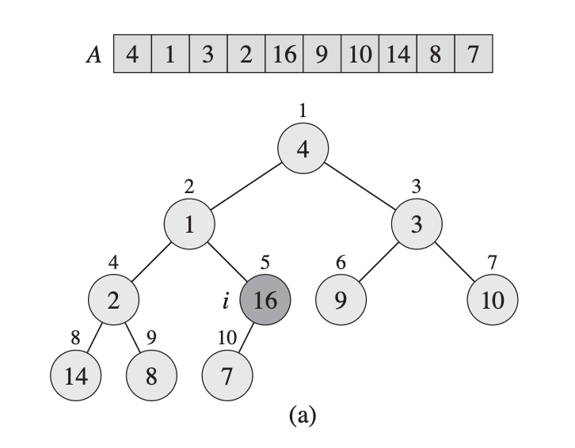
:::

힙이 아닌, 그냥 랜덤하게 숫자들이 나열된 배열을 완전 이진 트리로 생각해보자.

리프 노드들은 자식이 없기 때문에 그 자체를 하나의 서브트리이자 힙으로 볼 수 있다.<br>
그러면 리프 노드를 자식으로 가지는 노드는 $Heapify$를 호출할 전제를 만족하게 된다.

리프 노드들을 자식으로 가지는 모든 노드들에서 $Heapify$가 완료되면? <br>
그 노드들을 루트로 하는 서브 트리들을 힙이라고 부를 수 있게 된다.

그러면 또 그 노드들을 자식으로 가지는,<br>
리프 노드의 할아버지 노드들에서도 $Heapify$를 호출할 전제를 만족한다.

:::div{style="width: 508px"}
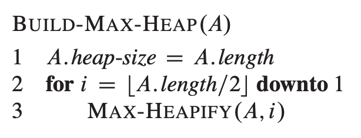
:::

이런 식으로 랜덤한 배열에서 $Heapify$를 bottom-up 방식으로 호출하면 <br>
배열 전체를 힙으로 만들 수 있고 그걸 반복문으로 적어놓은 알고리즘이 $Build\,\,Heap$이다.


:::div{style="width: 479px"}
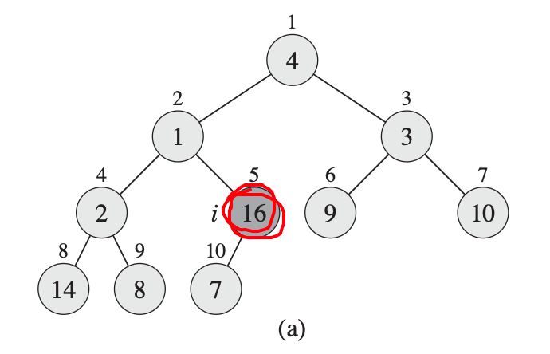
:::

$Build\,\,Heap$의 반복문에서 시작 인덱스는 힙 사이즈를 2로 나눠서 내림한 값이다.<br>
이건 그냥 외워도 되고, 왜 그런지 한번 따져보고 넘어가도 좋다.

:::div{style="width: 341px"}
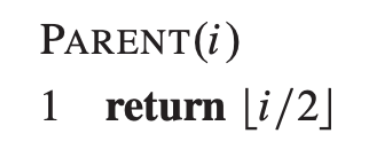
:::

1-based 배열에서 $i$번 노드의 부모 인덱스는, 자식이 왼쪽이나 오른쪽 어디에 있든지<br>
그 인덱스를 2로 나눈 값의 내림으로 표현된다.

따라서 마지막 인덱스 $n$의 부모는 힙 사이즈를 2로 나눠서 내림한 값이 된다.

마지막 노드의 부모 노드 이후로는 리프 노드이기 때문에<br>
해당 노드가 맨 뒤에서부터 처음으로 리프 노드가 아닌 노드가 되게 된다.


그러면 시간복잡도 $O(\log n)$ 짜리 $Heapify$를 $O(n)$ 번 호출하니까<br>
$Build\,\,Heap$의 시간복잡도는 $O(n \log n)$ 이겠구나 -> 아님

정확히는 아니라기보다는 시간복잡도의 Upper Bound를 더 낮출 수 있다.
:::div{style="width: 547px"}
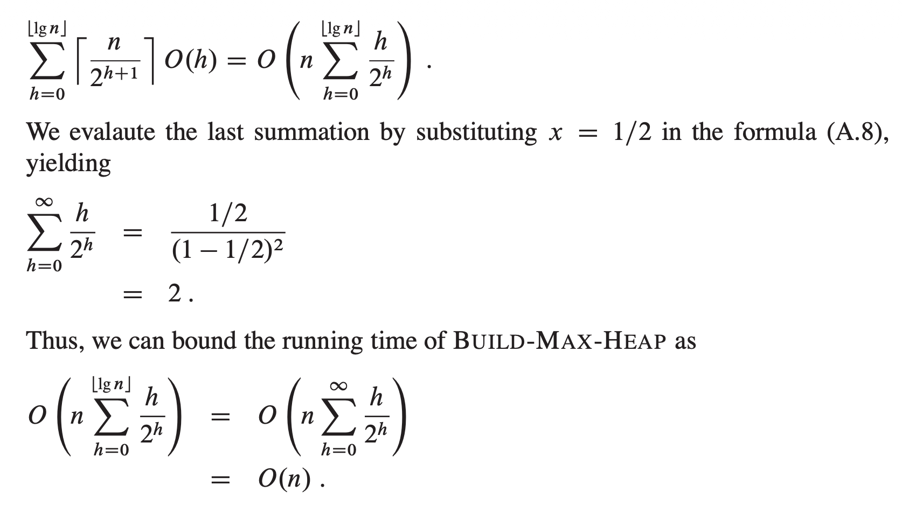
:::

CLRS에서는 수식을 통해 $O(n)$, 그러니까 선형 시간으로 실행 가능하다는걸 보인다.

아니 $Heapify$ 자체부터 이미 $O(\log n)$ 인데 어떻게 이걸 여러번한게 선형 시간이 나오냐<br>
처음에는 $Heapify$의 재귀 호출 비용이 거의 없기 때문이다.

:::div{style="width: 491px"}
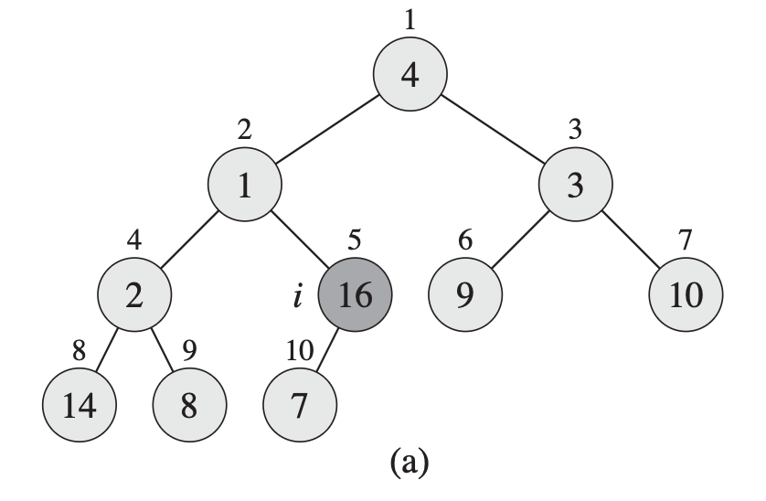
:::

다시 사진을 봐보자. <br>
$i$에서 $Heapify$를 호출하면 한번의 재귀 호출로 리프 노드에 도달하여 바로 종료된다.<br>
$i$와 같은 높이에 있는 노드들은 다 마찬가지다(오른쪽에 있는 애들은 빼고).

대신 높이가 올라가면 $Heapify$의 재귀 호출이 한번 증가한다.

완전 이진 트리에서 높이가 $h$인 노드는 최대 $\left\lceil n / 2^{h+1} \right\rceil$개다.

여기에 해당 높이에서 $Heapify$를 실행하는 비용 $O(h)$를 곱하고<br>
높이별로 전부 더하면 위에 사진에 첫줄에 있는 수식이 나온다.


식을 정리하면 $\sum h/2^h$ 부분은 상수로 수렴하고, 앞에 $n$이 곱해져서<br>
$Build\,\,Heap$의 시간복잡도가 $O(n)$이 된다.

직관적으로는 비용이 적게 드는 아래쪽 노드는 많고,<br>
비용이 많이 드는 위쪽 노드는 적기 때문에 선형 시간이 나오는거다.

## 힙 정렬
:::div{style="width: 380px"}
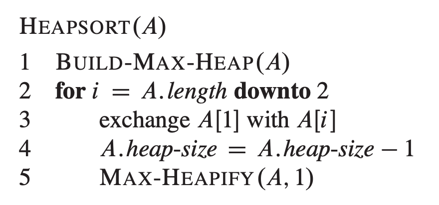
:::

최대 힙을 기준으로 적힌 수도 코드를 그대로 읽으면
- 맨 마지막 값과 첫번째값을 바꾼다
- 그리고 힙 사이즈를 하나 줄인다
- 그 다음에 루트에서 $Heapify$를 호출한다

이걸 루트 전의 노드까지 반복하면 해당 배열이 정렬된다.

3 line에 exchange는 현재 힙에서 최대값이 들어있다고 보장된 루트 값을<br>
맨 마지막에 있는 값과 바꾸고, 마지막 원소가 된 최대값을 힙에서 제외시킨다.

그러면 exchange가 일어난 후로 지금 힙에서 문제될 가능성이 있는건 루트 쪽 힙 속성 뿐이다.<br>
그래서 루트에서 $Heapify$를 호출해서 O(\log n)$의 시간으로 한 칸 줄어든 힙을 복구한다.

이걸 반복하는거다. 그러면 힙의 영역이 한칸씩 줄어들면서<br>
그 뒤쪽 배열은 오름차순으로 정렬된 숫자들이 남는다.

그런 식으로 루트 바로 앞의 원소까지 루트와 exchange되면 배열 전체가 정렬된 상태가 됨.<br>
시간복잡도는 $Heapify$를 $O(n)$번 하니까 $O(n \log n)$ 이다.

힙과 힙 정렬 실제 구현은 다음과 같이 할 수 있다.
```python
# Max Heapify
def heapify(A: list, i: int, end: int):
    largest = i
    l = 2 * i + 1
    r = l + 1
    # end : 맨끝 인덱스

    if l <= end and A[l] > A[i]:
        largest = l

    if r <= end and A[r] > A[largest]:
        largest = r

    if largest != i:
        A[i], A[largest] = A[largest], A[i]
        heapify(A, largest, end)

def build_heap(A: list):
    heap_size = len(A)
    start = (heap_size) // 2 - 1

    for i in range(start, -1, -1): # 첫번째 인덱스까지
        heapify(A, i, heap_size-1)


def heap_sort(A: list):
    heap_size = len(A)
    start = heap_size-1

    for i in range(start, 0, -1): # 첫번째 인덱스 전까지
        # swap
        A[i], A[0] = A[0], A[i]
        heap_size -= 1
        heapify(A, 0, heap_size-1)

# build_heap(nums)
# heap_sort(nums)
```

어차피 실제 코딩 테스트를 볼 때 힙 정렬을 구현해봐라.. 는건 거의 절대 안나올거긴한데<br>
시간복잡도 관점 말고, 실질적인 시간 소요를 따지면 이렇게 재귀적으로 짜는거보다

```python
# Max Heapify
def heapify(A: list[int], i: int, end: int):
    while True:
        largest = i
        left = 2 * i + 1
        right = left + 1

        if left <= end and A[left] > A[largest]:
            largest = left

        if right <= end and A[right] > A[largest]:
            largest = right

        if largest == i:
            return

        A[i], A[largest] = A[largest], A[i]
        i = largest


def heap_sort(A: list[int]):
    n = len(A)

    for i in range(n // 2 - 1, -1, -1):
        heapify(A, i, n - 1)

    for end in range(n - 1, 0, -1):
        A[0], A[end] = A[end], A[0]
        heapify(A, 0, end - 1)
```

이렇게 반복문으로 짜는 게 일반적으로 더 빠르다. 이론적인 시간복잡도는 둘 다 같지만<br>
재귀 방식은 한 레벨 내려갈 때마다 함수 호출과 스택 프레임 생성 비용이 추가되기 때문이다.

## 우선순위 큐
우선순위 큐는 나중에 그래프 알고리즘에서 많이 사용되는데<br>
어떤 연산들이 있고, 그 연산들로 어떻게 구현한건지 이해하면 된다.

:::div{style="width: 609px"}
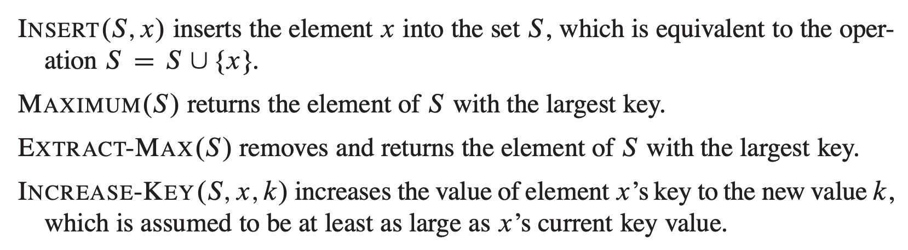
:::

$Maximum$은 그냥 최대 힙의 루트 값을 반환하는 간단한 녀석이고<br>
$Insert$, $Extract$, $Increase\,\,Key$의 작동 방식과 시간 복잡도를 알아보자.

:::div{style="width: 414px"}
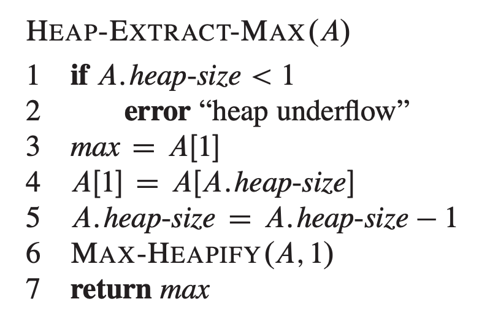
:::

$Extract$는 최대 힙에서 최대 값을 반환하면서 힙에서 제거해버린다.<br>
빈 공간이 된 루트에는 힙의 맨 마지막 값으로 채워서 힙 사이즈를 하나 줄이고<br>
루트에서 $Heapify$를 호출함으로 전체 배열을 힙으로 유지한다.

힙 정렬을 이해했다면 $Extract$도 딱히 어려울게 없다.

:::div{style="width: 533px"}
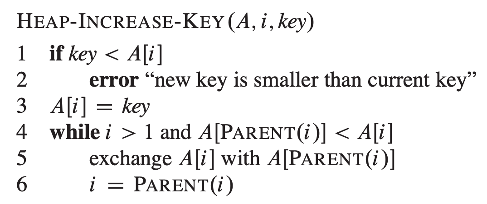
:::

$Increase\,\,Key$는 $i$번째 인덱스의 배열 값을 key로 증가시킨다(key가 기존 값보다 작으면 에러).<br>
값이 증가한만큼 힙에서 적절한 위치가 되도록 부모와 비교하며 exchange한다.

나중에 이 연산이 우선순위 큐에서 우선순위를 변경할 때 사용되는거다.

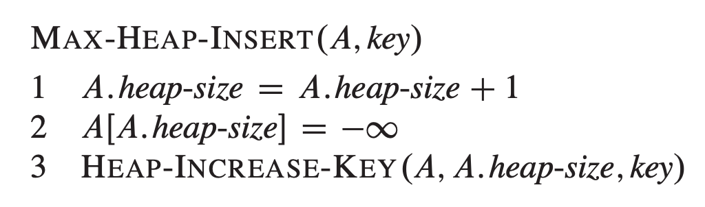

$Insert$는 힙 사이즈를 하나 추가한 후, 힙 속성을 위반하지 않을 매우 작은 수를 넣는다.<br>
그리고 그 후에 $Increase\,\,Key$로 기존에 내가 넣고 싶었던 값으로 변경한다.<br>
그러면 $Increase\,\,Key$의 동작으로 힙 안에서 적절한 곳에 위치하게 된다.

당장은 이런 연산들이 우선순위 큐 구현에 쓰인다는 것만 기억하자.

## 파이썬에서 힙 사용
실제 파이썬에서 힙을 사용할 때는 CLRS에서 배우는 내용과 차이가 있다.

```python
import heapq

# A : list
heapq.heapify(A)       # O(n)
heapq.heappush(A, x)   # O(log n)
x = heapq.heappop(A)   # O(log n)
x = A[0]               # O(1)
```

여기서 `heapify`는 우리가 아는 $Heapify$ 연산이 아니라 $Build\,\,Heap$ 연산이다.<br>
`heappush`는 $Insert$ 연산이고 `heappop`은 $Extract$ 연산이다.

그리고 파이썬의 힙은 CLRS와 다르게 최소 힙을 기준으로 만들어졌다.

```python
heapq.heappush(heap, (priority, value))
```

우선순위 큐를 사용할 때는 이렇게 튜플로 넣어주면 되는데<br>
튜플의 첫번째 원소가 우선순위, 두번째 원소가 실제 값이라고 생각하면 된다.

파이썬이 최소 힙이기 때문에 우선순위가 작은 값부터 나온다.
