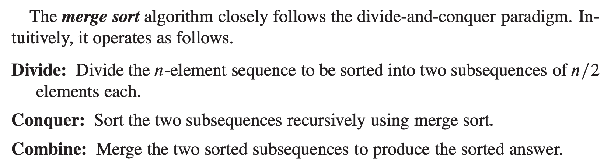

## Intro
병합 정렬의 핵심 아이디어는 분할 정복(Divide-and-Conquer)이다.<br>
분할 정복은 알고리즘을 디자인하는데 있어서 하나의 접근 방식(approach)이다.<br>

또 다른 접근 방식의 예를 들면, 삽입 정렬 같은 경우 incremental approach라고 할 수 있다.

이 알고리즘은 첫번째 원소부터 $j-1$개의 원소까지 정렬이 된 배열에<br>
$j$번째 값을 적절한 위치에 삽입하여 $j$개의 원소가 정렬된 배열을 얻게 된다.<br>

알고리즘이 진행되면서 정렬된 배열의 길이가 한칸씩 증가(increment)하는 구조인 것이다.<br>
그러면 분할 정복 접근 방식에서는 알고리즘이 어떤 식으로 진행되는걸까.<br>

## 분할 정복

### 분할 정복의 정의
숫자가 1부터 10까지 적힌, 무작위로 섞인 카드를 정렬해보라고 하면<br>
카드를 한장씩 정렬시키는 incremental approach를 써도 괜찮다.<br>

그런데 카드가 100장이라고 하면 그 중에서 숫자를 하나씩 찾는게 부담될 수 있다.

이렇게 문제의 사이즈가 커지면, 바로 해결하지 않고 같은 형태의 더 작은 문제로<br>
나누어서 해결하면 되는데 이러한 접근 방식을 분할 정복이라고 한다.<br>

### 분할 정복의 구조
분할 정복은 재귀적(recursive)인 구조를 갖게 된다.

큰 문제를 작은 문제로 분할했는데 여전히 문제 사이즈가 작지 않다면? 또 분할하면 한다.<br>
그래서 분할 정복에서는 문제의 사이즈가 충분히 작아질 때까지 분할을 반복한다.<br>

문제가 분할된 다음에는 가장 작게 분할된 문제에서부터 solution을 구하고<br>
분할된 문제들의 solution을 결합(Combine)하며 상위 문제의 solution을 구한다.<br>

이렇게 재귀적으로 분할된 문제들을 풀어나가는걸 정복(Conquer)이라고 한다.

정복과 결합이 정확하게 어떤 과정인지는 병합 정렬의 케이스로 보면 더 명확해진다.

## 병합 정렬(Merge Sort)

:::div{style="width: 575px"}

:::

병합 정렬에서 분할(Divide), 정복(Conquer), 결합(Combine)은 위 설명과 같다.

### 분할 정복 패러다임의 구조
분할에서는 하나의 배열을 2개의 서브 배열로 나누고<br>
정복에서는 두 개의 서브 배열을 병합 정렬의 재귀 호출로 정렬하고<br>
결합에서는 두개의 정렬된 서브 배열을 합쳐서 하나의 정렬된 배열을 만든다.<br>

정복에서 병합 정렬의 재귀 호출로 정렬한다는걸 자세히 설명하면<br>
병합 정렬 <- 어떤 배열을 넣고 이 녀석을 호출하면 정렬된 배열이 리턴된다.<br>

근데 정렬하는 방식이 그 배열을 분할해서 서브 배열로 다시 병합 정렬을 호출함<br>
밑에 재귀 호출이 서브 배열을 알아서 정렬해주면 그걸 결합해서 정렬하는거다.<br>

### 구현
실제 구현을 보면 정확하게 이해된다.

```python
def merge_sort(arr: list):
    merged_arr = [None] * len(arr)

    ### sort ###
    def sort(low, high):
        # base case
        if low >= high:
            return

        mid = (low + high) // 2

        sort(low, mid)
        sort(mid + 1, high)
        merge(low, mid, high)

    ### merge ###
    def merge(low, mid, high):
        i = low
        j = mid + 1
        k = low  # merged_arr의 index

        while i <= mid and j <= high:
            # 오름차순 정렬
            if arr[i] <= arr[j]:
                merged_arr[k] = arr[i]
                i += 1
            else:
                merged_arr[k] = arr[j]
                j += 1
            k += 1

        # 오른쪽 배열 다 소모했는데 왼쪽이 남음
        while i <= mid:
            merged_arr[k] = arr[i]
            i += 1
            k += 1

        # 반대 상황
        while j <= high:
            merged_arr[k] = arr[j]
            j += 1
            k += 1

        for k in range(low, high + 1):
            arr[k] = merged_arr[k]

    sort(0, len(arr) - 1)

    return arr  # return은 없어도 됨
```

`sort` 함수가 분할 정복의 뼈대다.

분할된 구간별로 동일한 `sort` 함수의 재귀 호출이 발생하고,<br>
low >= high 즉 배열의 길이가 1이거나 0인 경우에는 즉시 반환하게 된다.<br>

그러면 2개의 서브 배열이 정렬되는데, 이때 `merge` 함수로 하나의 정렬된 배열을 뽑아낸다.<br>
`merge` 함수는 2개의 서브 배열에서 서로 더 작은 값을 `merged_arr`에 채운다.<br>
`merged_arr`라는 임시 배열에 정렬된 값을 넣어놓고 마지막에 원본 `arr`에 옮겨오는 형태다.<br>

구현에서 신경 쓸 부분은 인덱스를 3개 쓴다는 점(2개의 서브 배열, 그리고 `merged_arr`의 인덱스)<br>
어느 한 쪽의 서브 배열을 먼저 다 썼을 경우, 나머지 배열을 그대로 이어붙인다는 점<br>
마지막으로 `merged_arr`라는 사전에 만들어둔 임시 배열의 값을 통해 정렬한다는 점이다.<br>

임시 배열을 사용하기 때문에 추가적인 메모리 공간이 $O(n)$ 만큼 필요하다.<br>
또한 `merge` 부분에서 두 서브 배열의 값이 똑같으면 왼쪽 배열의 값을 가져오기 때문에<br>
안정 정렬이 된다.<br>
그리고 파이썬에서는 배열 값 자체가 바뀌기 때문에 마지막에 리턴은 굳이 필요없다.<br>

정리하면 `sort`는 자신이 재귀 호출한 2개의 `sort`에서 서브 배열 2개를<br>
정렬해올거라고 가정하고 정렬된 2개의 서브 배열을 `merge`하는게 전부이다.<br>

`merge`는 그냥 합치는 작업을 하는건데 두 개의 서브 배열이 정렬된 상태라면<br>
하나의 정렬된 배열을 만들게 된다.<br>

`sort`의 base case에서 원소 하나짜리 구간이 그대로 반환된 뒤<br>
상위 호출에서 두 정렬 구간의 병합이 시작된다.<br>

### 시간 복잡도
병합 정렬은 배열의 크기가 1이 될 때까지 배열을 절반씩 나눈다.

배열의 크기가 $n$일 때

$$
n \rightarrow \frac{n}{2} \rightarrow \frac{n}{4} \rightarrow \cdots \rightarrow 1
$$

과 같은 형태로 분할되므로 재귀 호출의 깊이는 $\log n$이 된다.

각 깊이에서 실행되는 `merge`의 전체 작업량은 $O(n)$이다.<br>
첫 번째 깊이에서는 크기 $n$인 배열 하나를 병합하고,<br>
그 아래에서는 크기 $\frac{n}{2}$인 배열 두 개를 병합하는 식인데<br>
같은 깊이에 있는 배열의 원소 수를 모두 합하면 항상 $n$이다.<br>

따라서 전체 시간 복잡도는

$$
O(n) \times O(\log n) = O(n\log n)
$$

이 된다.

입력 배열이 이미 정렬되어 있어도 배열을 분할하고 각 구간을 병합하는 과정은 동일하다.<br>
그래서 병합 정렬은 최선, 평균, 최악의 경우 모두 $O(n\log n)$의 시간 복잡도를 갖는다.<br>
