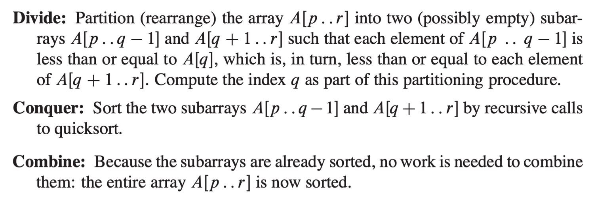
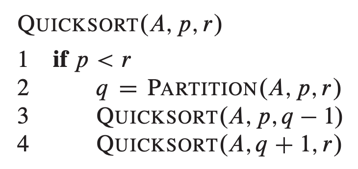
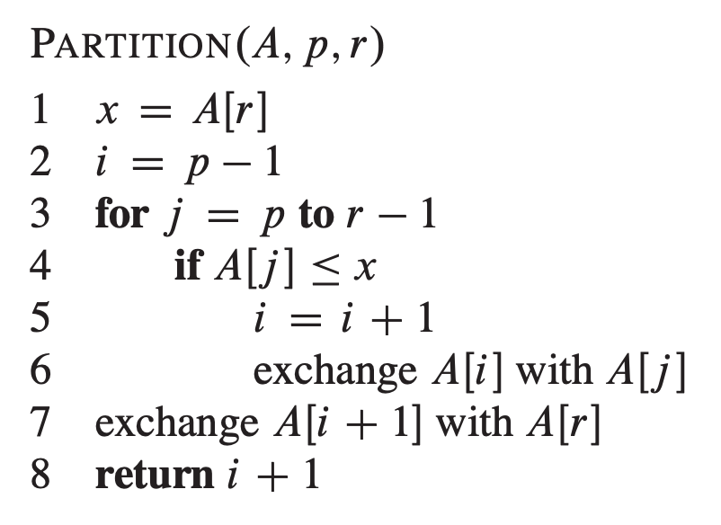
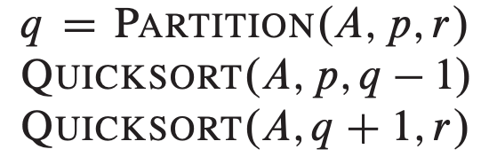
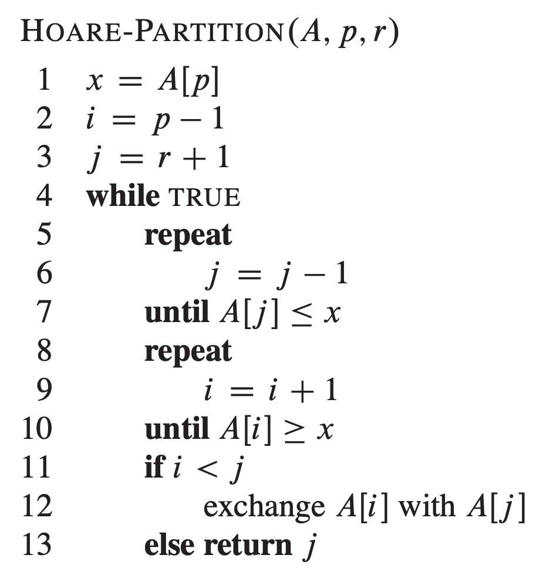

## Intro
퀵 정렬은 최악의 경우에 $O(n^2)$의 실행 시간이 걸린다.<br>
이름값을 못하는거 아닌가 할 수 있는데, 평균적으로는 효율적이고 빨라서 그렇다.<br>

기대(expected) 실행 시간은 $O(n \log n)$이며 in-place 방식이라는 장점이 있다.

## 퀵 정렬의 아이디어
퀵 정렬도 병합 정렬과 마찬가지로 분할 정복 패러다임을 사용한다.

:::div{style="width: 598px"}

:::

퀵 정렬은 파티션(Partition)이라는 과정이 있다. 먼저 배열에서 피벗(Pivot)값을 하나 고르고<br>
배열을 두 개의 영역으로 나눠서 한쪽은 피벗 이하로, 한쪽은 피벗 이상으로 만든다.<br>

그러면 두 영역 사이에 순서 관계가 생긴다.<br>
이걸 재귀적으로 반복하면 별도의 결합(Combine) 과정 없이 배열이 정렬된다.<br>

:::div{style="width: 353px"}

:::

그래서 수도 코드 자체는 매우 간단하다.<br>
중요한건 파티션을 어떤 방식으로 구현하냐 인데 2가지 방식이 있다.<br>

## 파티션(Partition)
우리말로 분할이라고도 하는 파티션은 위에서 말한 것처럼 배열을 두 개의 서브 배열로 나눈다.

### 파티션의 목표
파티션의 정확한 목표는 두 개의 서브 배열을 **in-place 방식**으로 적절하게 재배치해서<br>
피벗 이하의 값은 왼쪽 영역에, 피벗 이상의 값은 오른쪽 영역에 오도록 재배치하는 것이다.<br>

### Lomuto 파티션
대표적인 파티션 방법 2가지 중에 하나로 CLRS에서는 Lomuto 파티션을 기준으로 설명한다.

:::div{style="width: 345px"}

:::

Lomuto 파티션의 수도 코드에서는 3가지를 보면 된다.

- 무엇을 피벗으로 잡았는지
- `i`와 `j`가 무엇을 나타내는 인덱스인지
- line 7-8에서 exchange하고 return하는게 무슨 의미인지

먼저 피벗 `x`를 마지막 원소값 $A[r]$ 로 잡는다.<br>
Lomuto 방식에서 피벗을 꼭 마지막 값으로만 쓰는건 아닌데 CLRS에서는 그렇게 했다.<br>

그리고 인덱스 `i`와 `j`를 포인터로 쓰는데<br>
2개의 서브 배열의 포인터구나 <- 이렇게 넘겨짚으면 안된다.<br>

`i`는 피벗보다 작거나 같은 값을 발견할 때마다 왼쪽부터 채워넣으려고 만든 인덱스이고<br>
`j`는 피벗보다 작거나 같은 값을 탐색하기 위한 인덱스다.<br>

반복문을 통해 피벗보다 작거나 같은 값의 탐색이 끝난 후 `i`가 위치한 곳은<br>
피벗보다 작거나 같은 값으로 구성된 영역의 마지막 인덱스다.<br>

그래서 그 다음 인덱스인 `i+1`의 값과 피벗값을 교환하면<br>
`i+1`의 왼쪽은 모두 피벗 이하, 오른쪽은 피벗보다 큰 값으로 구성된다.<br>

:::div{style="width: 275px"}

:::

이 상태에서 피벗이 놓인 인덱스 `i+1`을 리턴하여 `q`라는 변수값에 넣고<br>
그 값을 기준으로 왼쪽 영역 $A[p \ldots q-1]$과 오른쪽 영역 $A[q+1 \ldots r]$에 대해<br>
다시 퀵 정렬을 재귀 호출한다. 피벗 $A[q]$는 이미 최종 위치에 있으므로 재귀 호출에서 제외함.<br>

반복문의 각 회차가 시작될 때 배열의 각 구간은 다음 상태를 유지한다.

| 구간 | 상태 | 의미 |
| --- | --- | --- |
| $A[p \ldots i]$ | 피벗 이하 | 검사가 끝난 왼쪽 영역 |
| $A[i+1 \ldots j-1]$ | 피벗 초과 | 검사가 끝난 오른쪽 영역 |
| $A[j \ldots r-1]$ | 미분류 | 아직 검사하지 않은 영역 |
| $A[r]$ | 피벗 $x$ | 반복문이 끝날 때까지 고정된 값 |

`j`가 한 칸 이동할 때마다 미분류 영역은 줄어들고,<br>
$A[j] \le x$인 경우에만 `i`가 증가하면서 피벗 이하 영역이 넓어진다.<br>

이렇게 반복문이 시작될 때마다 참이고, 반복이 한 번 끝난 뒤에도 계속 유지되는 조건을<br>
루프 불변식(Loop invariant)이라고 한다.<br>

파티션 방식마다 구체적인 불변식은 조금씩 다르니까 주의해야 한다.

### Hoare 파티션
CLRS에서는 연습 문제로 등장하는 Hoare 파티션이다.

:::div{style="width: 354px"}

:::

보통 유튜브 쇼츠나 롱폼에 퀵 정렬 설명하는거 보면 양쪽에서 인덱스가 움직이는데<br>
그게 바로 Hoare 파티션이다.<br>

마찬가지로 피벗부터 먼저 선택하면 되는데, 수도 코드에서는 맨 처음 원소를 골랐다.

`j`는 오른쪽에서 시작해서 피벗 이하의 값을 찾을 때까지 왼쪽으로 이동하고<br>
피벗 이하의 값을 찾으면 거기 잠시 주차한다<br>

`i`는 반대로 왼쪽에서 시작해서 피벗 이상의 값을 찾을 때까지 오른쪽으로 이동하고<br>
피벗 이상의 값을 찾으면 거기 잠시 주차한다.<br>

그 후에 `i`가 `j`보다 작다면, 그러니까 둘이 교차되지 않았다면 둘의 값을 바꾼다.<br>
`i`는 왼쪽에서 잘못 자리잡은 피벗 이상의 값을 가리키고, `j`는 오른쪽에서 잘못 자리잡은<br>
피벗 이하의 값을 가리키고 있으므로 둘을 교환하면 각각 알맞은 영역으로 들어간다.<br>

`i`는 피벗보다 작은 값들을 지나가다가 피벗 이상의 값을 만나면 멈추고,<br>
`j`는 피벗보다 큰 값들을 지나가다가 피벗 이하의 값을 만나면 멈춘다.<br>
이 과정을 반복하면 왼쪽의 피벗 이하 영역과 오른쪽의 피벗 이상 영역이 점점 넓어진다.<br>

그러다가 `i`와 `j`가 만나거나 교차하면 `j`를 리턴한다.<br>
이때 `j`는 피벗의 최종 위치가 아니라 왼쪽 영역의 마지막 인덱스이자 두 영역의 경계다.<br>

따라서 왼쪽 영역은 $A[p \ldots j]$, 오른쪽 영역은 $A[j+1 \ldots r]$이 되고<br>
각 영역에 대해 다시 퀵 정렬을 재귀 호출한다.<br>
Lomuto와 달리 피벗이 반드시 `j`에 위치하는 것은 아니다.<br>

피벗과 같은 값을 만나면 두 포인터가 모두 멈출 수 있는데<br>
`i < j`라면 같은 값끼리라도 교환 과정을 거친다.<br>

다음 반복에서 두 포인터가 다시 안쪽으로 이동해야 같은 위치에서 반복해서 멈추지 않기 때문이다.

파이썬 코드로 아래와 같이 구현할 수 있다.

```python
def hoare_partition(arr, p, r):
    pivot = arr[p]
    i = p - 1
    j = r + 1

    while True:
        while True:
            j -= 1
            if arr[j] <= pivot:
                break

        while True:
            i += 1
            if arr[i] >= pivot:
                break

        if i < j:
            arr[i], arr[j] = arr[j], arr[i]
        else:
            return j


def quicksort(arr, p, r):
    if p < r:
        q = hoare_partition(arr, p, r)
        quicksort(arr, p, q)
        quicksort(arr, q + 1, r)
```

Hoare 파티션이 반환하는 `q`는 피벗의 최종 위치가 아니라 두 영역의 경계이므로<br>
Lomuto 파티션과 다르게 왼쪽 재귀 범위에 `q`를 포함한다.<br>

### Lomuto와 Hoare 비교
두 파티션은 피벗을 기준으로 배열을 두 영역으로 나눈다는 목적은 같다.<br>
차이는 피벗을 처리하는 방법과 반환하는 인덱스의 의미에 있다.<br>

| 구분 | Lomuto 파티션 | Hoare 파티션 |
| --- | --- | --- |
| 탐색 방향 | 왼쪽에서 오른쪽으로 탐색 | 양쪽에서 안쪽으로 탐색 |
| 피벗 | 파티션이 끝나면 최종 위치에 있음 | 파티션 도중 위치가 바뀔 수 있음 |
| 반환값 | 피벗의 최종 인덱스 | 두 영역을 나누는 경계 |
| 재귀 범위 | $A[p \ldots q-1]$, $A[q+1 \ldots r]$ | $A[p \ldots q]$, $A[q+1 \ldots r]$ |
| 교환 | 피벗 이하의 값을 찾을 때마다 교환 | 서로 잘못된 영역에 있는 두 값을 교환 |

Lomuto는 한 방향으로만 탐색해서 이해하기 쉽지만 교환 횟수가 많아질 수 있다.<br>
Hoare는 양쪽에서 잘못 배치된 값을 한 번에 교환하기 때문에 일반적으로 교환 횟수가 더 적다.<br>

중요한건 반환값의 의미와 재귀 범위를 한 세트로 기억하는 것이다.<br>
두 방식의 파티션 코드와 재귀 범위를 섞어 쓰면 안된다.<br>

## 피벗 선택과 시간복잡도
파티션 자체는 배열을 한 번 훑으므로 $O(n)$의 시간이 걸린다.<br>
퀵 정렬의 전체 시간복잡도는 피벗이 배열을 얼마나 균형 있게 나누는지에 따라 달라진다.<br>

### 균형 있게 나눈 경우
피벗이 배열을 비슷한 크기의 두 영역으로 나눈다고 해보자.

각 재귀 깊이에서 파티션하는 원소 수를 모두 합하면 $n$이고,<br>
배열의 크기를 절반씩 줄이면 재귀 깊이는 $\log n$이 된다.<br>

따라서 시간복잡도는 다음과 같다.

$$
O(n) \times O(\log n) = O(n \log n)
$$

### 한쪽으로 치우친 경우
피벗이 매번 최솟값이나 최댓값으로 선택되면 한쪽에는 원소가 없고<br>
다른 한쪽에는 나머지 원소가 전부 들어간다.<br>

$$
n \rightarrow n-1 \rightarrow n-2 \rightarrow \cdots \rightarrow 1
$$

이 경우에는 재귀 깊이가 $n$이 되고, 전체 작업량은 다음과 같다.

$$
n + (n-1) + (n-2) + \cdots + 1 = O(n^2)
$$

첫 원소나 마지막 원소를 항상 피벗으로 고르면 이미 정렬된 배열에서 이런 상황이 발생할 수 있다.<br>
무작위로 피벗을 선택하면 매번 균형 있게 나뉜다고 보장할 수는 없지만,<br>
계속 최악의 피벗만 고를 가능성을 낮출 수 있다.<br>

그래서 무작위 피벗을 사용하는 퀵 정렬의 기대 실행 시간은 $O(n \log n)$이다.

## 퀵 정렬의 특징
퀵 정렬은 별도의 임시 배열 없이 원본 배열 안에서 값을 교환하는 in-place 정렬이다.<br>
다만 재귀 호출을 위한 스택 공간은 평균 $O(\log n)$, 최악의 경우 $O(n)$만큼 필요하다.<br>

값을 멀리 떨어진 위치와 교환할 수 있기 때문에 안정 정렬은 아니다.

병합 정렬과 비교하면 다음과 같다.

| 구분 | 퀵 정렬 | 병합 정렬 |
| --- | --- | --- |
| 시간복잡도 | 평균 $O(n \log n)$, 최악 $O(n^2)$ | 항상 $O(n \log n)$ |
| 추가 배열 | 필요 없음 | $O(n)$ 필요 |
| 안정 정렬 | 아님 | 맞음 |
| 결합 과정 | 필요 없음 | 정렬된 두 배열을 병합 |

퀵 정렬은 파티션 과정에서 연속된 배열 구간을 훑고 별도의 임시 배열도 만들지 않는다.<br>
이런 메모리 접근 방식은 공간 지역성이 좋고 실제 실행에서 상수 계수도 작아서 평균적으로 빠르다.<br>

CLRS에서는 퀵 정렬이 가상 메모리 환경에서도 잘 동작한다고 설명한다.

접근한 메모리 주변을 이어서 사용하고 추가로 건드리는 메모리 영역이 작아서<br>
페이지 교체 부담이 비교적 적기 때문이다.<br>

다만 메모리에 올릴 수 없을 만큼 큰 데이터를 저장장치에서 정렬하는<br>
외부 정렬에서는 병합 정렬 계열이 더 적합하다.<br>
