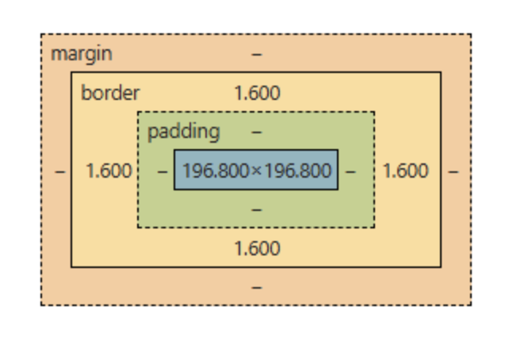

## CSS 박스 모델



브라우저가 HTML 요소들을 볼 때, 각각을 하나의 박스로 인지한다.

박스의 구성은 위 그림과 같이 4겹으로 되어있고,<br>
안에서부터 content, padding, border, margin이라고 한다.

태그에 width를 줄 때 실질적으로 적용되는 부분은 content이다.

## 박스 스타일 속성

레이아웃은 보통 `<div>` 태그로 만든다.

```html
<div class="box"> 레이아웃에 들어갈 내용 </div>
```
태그에 `box`라는 class를 부여했다.

이제 CSS에서 `.box` 셀렉터로 이 박스에 스타일을 적용해보자.

```css
.box {
  margin: 20px;
  padding: 16px;
  border: 1px solid #ccc;
  border-radius: 3px;
}
```

- `margin`: 박스 바깥쪽 여백 (다른 요소와의 간격)
- `padding`: 박스 안쪽 여백 (content와 border 사이 공간)
- `border`: 테두리 (두께 / 선 종류 / 색상)
- `border-radius`: 모서리를 둥글게 해주는 정도

이 네 가지 속성만 잘 다뤄도 네모 박스 기반의 기본 레이아웃은 대부분 만들 수 있다.


## display 속성

박스가 화면에 어떻게 배치되는지는 `display` 속성이 결정한다.

`<div>`, `<p>`, `<h1>`, `<li>` 같은 태그들은 기본적으로 `display: block`이 적용되어 있음<br>
Block 요소는 화면에서 한 줄을 통째로 차지하기 때문에 여러 박스를 쓰면 한줄씩 쌓이게 됨

이 기본 동작을 바꾸고 싶다면 display 값을 다른 걸로 바꾸면 된다.

- `block`: 한 줄 전체 차지 (기본값)
- `inline`: 글자처럼 흐름을 따라감, 폭/높이 지정 불가
- `inline-block`: inline처럼 옆으로 붙지만 폭/높이 지정 가능

CSS에서 display 값은 다음과 같이 바꾼다.

```css
.box {
    ...
    display: inline-block;
}

```


:::note[참고]
이 포스팅은 코딩애플 강의 기반 정리라서 float, inline-block 등 전통 기법을 다룬다.<br>
현대 프론트엔드에서는 `flex`, `grid`가 주류지만, <br>
박스 모델과 display 같은 기초 개념은 `flex`/`grid`에서도 그대로 쓰인다.
:::


## 스타일 상속

어떤 스타일들은 부모에서 자식으로 상속(inherit)될 수 있다.

### 부모 태그

```html
<div>
    <p> 자식 태그에용 </p>
</div>
```
HTML에서는 태그를 태그로 감싸는게 가능한데<br>
감싼 태그를 부모 태그, 감싸인 태그를 자식 태그라고 한다.

### 태그 간 상속

```html
<div style="color: red;">
    <p> 빨강색 </p>
    <span> 나두 </span>
</div>
```
`<div>` 태그에 스타일 속성으로 글자 색을 지정하면<br>
자식 태그인 `<p>` 태그와 `<span>` 태그에도 동일한 스타일이 적용된다.

이걸 상속(inheritance)이라고 한다.

<br>

```html
<div style="color: red;">
    <p> 빨강색 </p>
    <span stye="color: blue;"> 나는 파랑 </span>
</div>

```

자식이 자기 스타일을 따로 지정하면 상속 받은 스타일이 덮어씌워짐


### 상속되는 속성

모든 속성이 상속되는 건 아니다. 주로 **글자 관련 속성**만 상속된다.

| 상속 O | 상속 X |
|---|---|
| `color` | `margin` |
| `font-size` | `padding` |
| `font-family` | `border` |
| `font-weight` | `width`, `height` |
| `text-align` | `background` |
| `line-height` | |

박스 크기나 여백은 요소마다 달라야 하는 게 일반적이라<br>
박스 관련 속성들은 대부분 상속되지 않는다.


---
> 코딩애플 프론트엔드 강의를 참고해 정리한 내용입니다