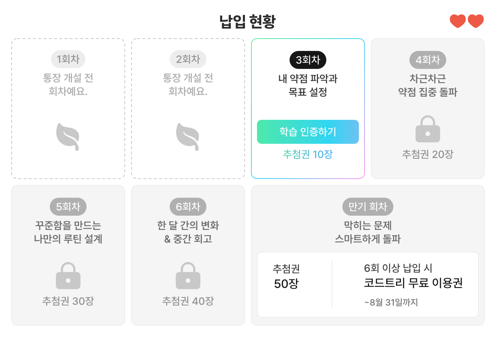
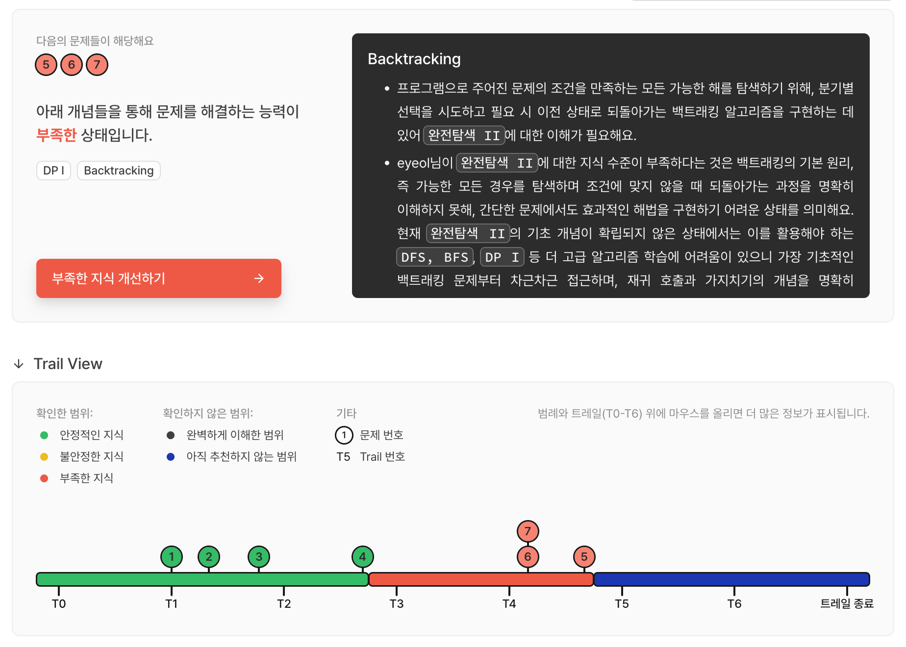
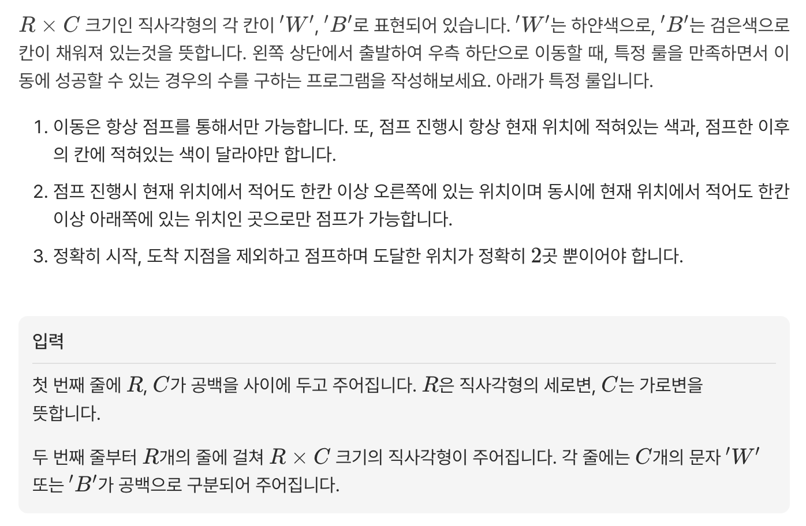

## 코드트리 1일차

예전에 코드트리라는 사이트를 소개 받아서 이런저런 기출 문제랑 알고리즘 커리큘럼이 있는건 알고 있었는데<br>
비용이 한달에 10만원 정도? 3달이면 17만원 정도이긴 한데 그래도 좀 비싸다는 느낌이 있어서 등록하지는 않았다.

그러다가 혼자 알고리즘 공부하는거에 한계를 느껴서 다시 코드트리를 찾았는데, [청약 통장](https://www.codetree.ai/ko/no-free-lunch-2026)이라는 이벤트 중이었다.

https://www.codetree.ai/ko/no-free-lunch-2026

### 청약 통장 등록


쉽게 말해 매주 공부 열심히 하면서 공부 일지 작성하면 공짜로 쓰게 해줄게<br>
일지 작성하면 추첨권도 주는데 그걸로 경품 추첨도 할 수 있어 

안할 이유가 없어서 등록을 하긴 했는데 문제가 좀 있었다. 내가 등록을 남들보다 2주 정도 늦게 한거다.



나도 8월 31일까지 코드트리 쓰고 싶은데.....<br>
하필 내가 등록한게 주말에 오늘이 부처님 오신 날이라 지금부터 제출해도 8월 31일까지 쓸 수 있는지 알 수가 없다.

그래도 어차피 코드트리 하기로 마음 먹은거니까 일단 공짜로 쓸 수 있는 기간 동안 열심히 해보자.


### 갭체크



이런저런 문제를 풀게 하는데 갈수록 난이도가 올라간다.<br>
내 경우에는 레벨 6 문제까지 잘 풀다가 7부터 9의 문제는 손대기도 어렵다는 느낌을 받았다.

특히 DP랑 백트래킹은 백준으로 공부 충분히 했다고 생각했는데 그게 아니었다.<br>
부족한 지식 개선하기를 누르니까 완전탐색과 백트래킹 부분을 공부하라고 추천을 해줬다.

### 트레일 공부 계획

갭체크를 통해 추천 받은 트레일은 완전탐색이 있는 2와 백트래킹이 있는 4인데<br>
구성을 보니까 트레일 2 전체를 확실하게 짚고 넘어가는게 좋겠다는 생각이 들었다.

트레일 0~1은 너무 간단한 내용이라 챕터 3개 푸는데 1시간 정도 걸렸다.<br>
날 잡고 하루면 끝낼거 같긴한데 다른 할 것들이 너무 많아서 매일 챕터 2-3개 정도씩 해야겠다.

### 트레일 2

#### 유클리드 호제법

처음 챕터인 함수와 갭체크에서 추천해준 완전탐색을 공부했는데<br>
함수 부분에서 유클리드 호제법을 알아야 하는 최대공약수 문제가 나왔다.

```python
n, m = map(int, input().split())

def gcd(a, b):
    while b != 0:
        a, b = b, a % b
    return a

print(gcd(n, m))
```
이게 알고나면 별거 아닌데, 이런 방법을 몰랐을 때 나는

각 숫자보다 작은 소수 리스트를 구해서 그 중에서 나누어떨어지는 애들로 소인수분해를 하고<br>
두 숫자의 소인수분해 리스트를 만들어서 공통되는 부분으로 최대공약수를 만들었다..

사실 지금도 왜 저렇게 하면 최대공약수가 되는지 수학적으로 제대로 아는게 아니라서<br>
유클리드 호제법이랑, 소수 관련해서는 에라토스테네스의 체를 언제 한번 공부해야겠다 생각은 하고 있었다.

근데 미루고 미루다보니 몇달째 공부 안했다는걸 오늘 느꼈음..<br>
이번 주에는 무조건 관련해서 공부하고 포스팅해야겠다.

#### 전역 변수, 지역 변수, 스코프

뿐만 아니라 전역 변수와 지역 변수에서 내가 맨날 헷갈리던 내용이 다뤄서 좋았다.<br>

개념 부분에 막 엄청 자세하게 설명되어있는건 아니었는데, 일단 주제가 던져지니까<br>
코덱스한테 관련 개념 물어보고 옵시디언에 정리하는 흐름이 자연스럽게 생겼다.

#### 탑다운 방식으로 생각하기

```python
def is_magic_number(n):
    return n % 3 != 0 and n % 5 == 0

cnt = 0
for i in range(1, 101):
    if is_magic_number(i):
        cnt += 1

print(cnt)

>> 14
```
어떤 조건을 만족하는 숫자들의 개수를 구하라는 문제다.

이런 문제를 풀 때<br>
특별한 조건을 만족하면 1을 더하면 되겠네? 라는 전체 흐름을 먼저 생각하고<br>
이런 식으로 특별한 조건 만족하는지 체크하면 되겠네? 라는 세부 구현을 생각하는게<br>
탑다운 방식으로 생각하는거다.

당연히 평소에 어느 정도는 이런 식으로 하고 있을텐데<br>
사고 방식에 대해 내가 인지적으로 의식할 수 있게 된 것 같다.

#### 완전 탐색

완전 탐색은 말 그대로 가능한 경우의 수를 전부 체크하는거다.

경우의 수를 체크할 때 brute force처럼 반복문을 무식하게 돌려볼 수도 있지만<br>
재귀나 백트래킹 같은 방법을 써서 체계적으로 모든 경우의 수를 훑는 것도 완전 탐색이다.

그러니까 완전 탐색에서는 단순하게 전부 다 보면 되는구나 가 아니고<br>
어떤 상황에서 완전 탐색할지, 어떤 도구를 써서 탐색할지를 판단하는 능력이 중요한거다.



이 문제의 경우, 경유 포인트가 2개로 정해졌기 때문에 이중 반복문으로 첫번째 경유 포인트를 찾고<br>
그 찾은 시점에서 또 이중 반복문으로 두번째 경유 포인트를 찾으면 된다.

```python
R, C = map(int, input().split())
grid = [list(input().split()) for _ in range(R)]

from collections import deque

# cx, cy에서 탐색 범위 : cx+1 to R-2 and cy+1 to C-2
# 가능한 점들 모두 후보 넣기

def search(cx, cy, jump):
    color = grid[cx][cy]
    nxts = []

    for x in range(cx+1, R-1):
        for y in range(cy+1, C-1):
            if grid[x][y] != color:
                nxts.append((x, y, jump+1))
    
    return nxts

q = deque([(0, 0, 0)])

final = grid[R-1][C-1]

ans = 0

while q:
    cx, cy, jump = q.popleft()
    if jump == 2:
        if grid[cx][cy] != final:
            ans += 1
        continue

    nxts = search(cx, cy, jump)

    for nxt in nxts:
        q.append((nxt))

print(ans)
```
나는 bfs로 될것 같아서 bfs로 풀었다.

만약에 경유지 개수에 제한이 없거나 4개 이상이라면 중첩 반복문보다는 bfs가 일반화하기 더 편하지 싶다.

### 1일차 후기

어제 등록하고 오늘이 제출 날이라 많은 내용을 적지는 못했다..<br>

일단 내가 모르는 내용 또는 부실한 내용들을 공부하니까 좋았다.<br>
문제 푸는게 제일 재밌고, 결과가 어떻게 될까용 하는 것도 처음엔 좀 힘들었는데<br>
이게 무엇을 위한 코드인가 생각하면서 푸니까 사고력이 증진되는 맛이 있었다.

이제 문제는 청약 통장 등록을 늦게 해서 2주치 제출을 못했어도<br>
8월 31일까지 코드 트리를 무료로 쓸 수 있냐 이건데 내일 문의를 해봐야겠다...


#코드트리 #코딩테스트 #코테공부 #코테준비 #알고리즘공부 #갭체크