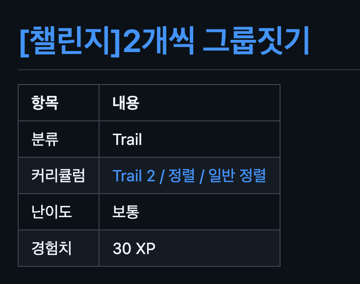

## 코드트리 3주차

감기 때문에 지난 주차 후기 제출을 못했다.

이번 주차 후기는 문제 풀이 내용보다는 코드트리를 어떤 식으로 공부 루틴에 붙이고 있는지에 대해 적어보려고 한다.

나는 코드트리를 풀 때 깃허브 연동 기능을 같이 사용하고 있다.<br>
문제를 풀면 풀이 코드가 깃허브 레포에 남고, 문제별 폴더와 README도 같이 정리된다.

처음에는 그냥 잔디 심기용으로 괜찮겠다 정도로 생각했는데, 막상 써보니 이게 생각보다 좋은 학습 기록이 됐다.

### 깃허브 연동이 좋은 이유

코딩테스트 공부는 문제를 풀 때보다, 풀고 난 뒤에 다시 보는 과정이 더 중요하다고 느낀다.

그런데 플랫폼 안에서만 문제를 풀면 내가 어떤 주제를 언제 풀었는지, 어떤 방식으로 풀었는지 다시 보기 귀찮아진다.<br>
반면 깃허브에 풀이가 남으면 커밋 기록 자체가 공부 기록이 된다.



특히 코드트리 연동 레포는 문제들이 트레일과 주제 단위로 어느 정도 구조화되어 있다.

예를 들어 [코드트리 Novice Mid 트레일](https://www.codetree.ai/trail-info/novice-mid/)에서 푼 문제들은 `trail2` 아래에 쌓이고,<br>
각 문제 폴더 안에는 풀이 코드와 README가 같이 남는다.

README에는 이 문제가 어느 트레일의 어떤 주제에 속하는지도 적혀 있다.<br>
예를 들면 `Trail 2 / 시뮬레이션 II / 최장 연속 부분 수열` 같은 식이다.

그냥 코드 파일만 있으면 나중에 봤을 때 이게 무슨 맥락에서 푼 문제인지 다시 떠올려야 한다.<br>
하지만 트레일, 주제, 문제 이름, 풀이 코드가 같이 남아 있으면 복습할 때 훨씬 빠르게 맥락을 잡을 수 있다.

### Codex로 복습하기

나는 이 연동 레포를 Codex나 Claude Code로 다시 훑어보는 식으로 활용하고 있다.

예를 들면 이런 식으로 물어본다.

```text
Trail 2 시뮬레이션 II에서 내가 푼 문제들 훑고,
여기서 배울만한 패턴이 뭔지 정리해줘.
```

혹은

```text
완전탐색 I에서 자리 수 단위로 완전탐색하는 문제들만 보고,
공통 풀이 방식과 주의할 점을 정리해줘.
```

이렇게 물어보면 단순히 일반적인 알고리즘 설명을 듣는 게 아니라, 내가 실제로 푼 코드와 문제 묶음을 기준으로 복습할 수 있다.

예를 들어 이번에 `최장 연속 부분 수열` 문제들을 다시 보면서<br>
핵심이 LCS 같은 어려운 DP가 아니라, `cnt`와 `max_cnt`로 현재 연속 구간을 추적하는 기초 시뮬레이션 패턴이라는 걸 정리했다.

내가 풀 때는 그냥 문제 하나하나를 해결하는 느낌이었는데,<br>
나중에 묶어서 보니까 “아, 이 파트는 배열을 한 번 훑으면서 연속 상태를 관리하는 연습이구나” 하고 보였다.

### 이전 공부 방식과 비교

예전에는 알고리즘 공부를 할 때 문제를 풀고 끝나는 경우가 많았다.

문제를 풀었다는 기록은 남지만, 그 문제에서 뭘 배웠는지는 따로 정리하지 않으면 금방 흩어진다.<br>
특히 비슷한 유형을 여러 개 풀었는데도, 나중에 보면 그냥 “많이 풀었다” 정도로만 남기 쉽다.

코드트리 깃허브 레포를 세팅해두면 문제 풀이 코드가 자동으로 쌓이고, 트레일과 주제 정보도 같이 남으니까<br>
나중에 코드 에이전트에게 “이 묶음에서 배울 점을 뽑아줘”라고 시킬 수 있다.

물론 AI가 정리해준다고 해서 내가 이해한 것이 되는 건 아니다.<br>
그래서 마지막에는 항상 내가 직접 다시 읽고, 맞는 말인지 확인하고, 내 언어로 노트나 블로그에 옮겨야 한다.

그래도 첫 복습 진입 장벽을 낮춰준다는 점에서는 꽤 괜찮다.

### 앞으로의 루틴

앞으로도 문제를 풀고 끝내는 게 아니라, 일정 단위로 레포를 다시 훑어보려고 한다.

1. 코드트리에서 문제를 푼다.
2. 깃허브 연동으로 풀이 기록을 남긴다.
3. Codex나 Claude Code에게 같은 주제 문제들을 묶어서 보게 한다.
4. 공통 패턴, 헷갈린 부분, 다시 풀어볼 문제를 정리한다.
5. 필요한 내용은 Obsidian 노트나 블로그로 옮긴다.

이 방식이 마음에 드는 이유는, 내가 공부한 흔적이 그냥 사라지지 않는다는 점이다.

코테 공부는 결국 반복이 중요하다고 생각한다.<br>
그런데 반복하려면 내가 뭘 했고, 어디서 막혔고, 어떤 패턴을 얻었는지 다시 찾을 수 있어야 한다.

코드트리 깃허브 연동은 그 기록을 남기는 데 꽤 잘 맞는다.

아직은 트레일2를 끝내는 중이라 갈 길이 멀지만,<br>
문제를 푸는 것과 복습 루틴을 같이 만들고 있다는 점에서는 꽤 만족스럽다.


#코드트리 #코딩테스트 #코테공부 #코테독학 #개발자루틴 #1일1코테
