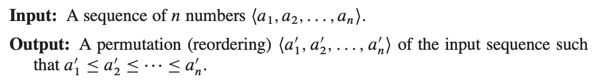

## 정렬 문제

알고리즘 교과서(CLRS)를 펴면 가장 먼저 나오는게 정렬 문제이다.



숫자로 이루어진 배열이 주어졌을 때, 정렬된 배열을 구해야 한다.

### Selection Sort

가장 직관적으로 떠올릴 수 있는 정렬 방법은 가장 작은 값을 찾아서 맨 앞으로 보내고, 그 다음 작은 값을 그 다음 위치로 보내는거다.

다음과 같이 수도코드(pseudocode)를 짤 수 있다.

```pascal
SELECTION-SORT(A)
  for i = 1 to A.length-1
  // minIndex = index of the smallest element
     minIndex = i
     // Selection
     for j = i+1 to A.length
         if A[j] < A[minIndex]
             minIndex = j
     exchange A[i] with A[minIndex]
```

line 6-9은 `A[i, ... , N]`에서 가장 작은 값을 찾아서 `A[i]`에 위치시킨다.

`i=1`일 때는 전체 배열에서 가장 작은 값이 `A[1]`에 오고 <br>
`i=N-1`일 때는 `A[N-1, N]`에서 가장 작은 값이 `A[N-1]`에 오게 된다.

따라서 첫번째 반복문(line 2-9)의 매 반복마다 `A[1, ... , i-1]`은 정렬된 상태라고 말할 수 있다.

마지막 루프가 종료된 후에는 `A[1, ... , N]` 전체가 정렬된 상태가 된다.

파이썬 코드로 짜면 다음과 같다.
```python
def selection_sort(A: list):
    for i in range(0, len(A)-1):
        minIndex = i
        for j in range(i+1, len(A)):
            if A[j] < A[minIndex]:
                minIndex = j
        A[i], A[minIndex] = A[minIndex], A[i]
```

### Bubble Sort

버블 정렬은 거품이 뽀글뽀글 수면 위로 떠오르는걸 생각하면 된다.

```pascal
BUBBLE-SORT(A)
  for i = 1 to A.length-1
      for j = A.length downto i+1
          if A[j] < A[j-1]
              exchange A[j] with A[j-1]

```
여기서도 첫번째 반복문(line 2-5)의 매 반복마다 `A[1, ... , i-1]`이 정렬된 상태라고 말할 수 있다.

`exchange`가 inner loop 밖에 있는 선택 정렬과 다르게, 버블 정렬은 inner loop 내부에 `exchange`가 있다. 이런 구조면 인접한 원소끼리만 swap하기 때문에 상대 순서가 보존된다.

#### 상대 순서가 중요한 상황
```python
# 진화순으로만 정렬된 상태
(2, 파이리), (1, 이상해씨), (2, 리자드), (1, 이상해풀)


# 선택 정렬 결과 (unstable)
(1, 이상해씨), (1, 이상해풀), (2, 리자드), (2, 파이리)

# 버블 정렬 결과 (stable)
(1, 이상해씨), (1, 이상해풀), (2, 파이리), (2, 리자드)
```

### 비교

둘다 이중 반복문이라서 시간복잡도가 $O(n^2)$인건 동일하다.

하지만 swap 연산량에서 다음과 같은 차이가 있다.
- 선택 정렬 : $O(n)$
- 버블 정렬 : 최대 $O(n^2)$

swap 대상이 구조체처럼 무거운 자료구조라면 확실하게 선택 정렬이 똑똑한 선택일 것이다.
<br>
다만 안정성(Stability)이 요구되는 상황이라면 버블 정렬을 써야 한다.

## 슬픈 결론

근데 사실.. 알고리즘 문제 풀 때, 둘다 안쓴다..

이 두 친구는 CLRS에서 예제나 실습으로나 언급되고 마는 녀석들이다..
<br>
실질적으로는 삽입 정렬과 병합 정렬을 정확하게 공부하는게 중요함

선택 정렬, 버블 정렬 <- 이렇게 생겼구나 하고 넘기면 됨
<br>
안정성(Stability) 부분만 기억하자